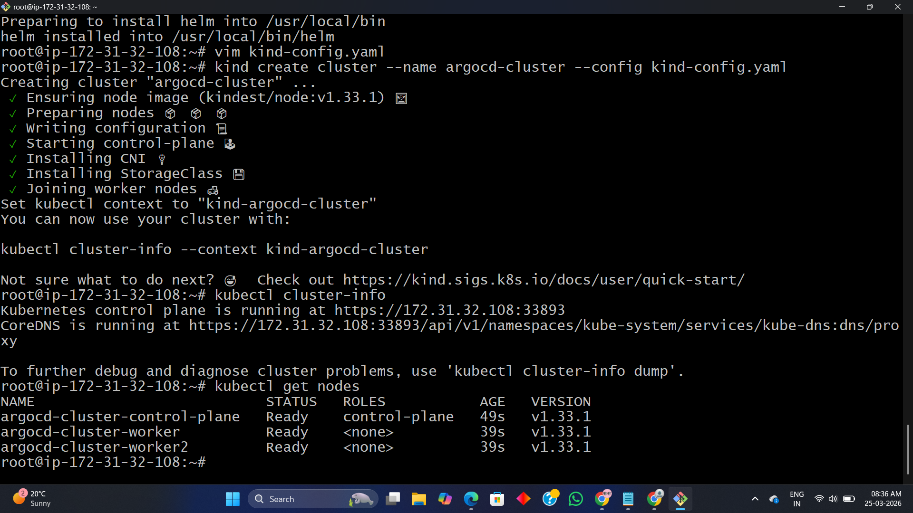
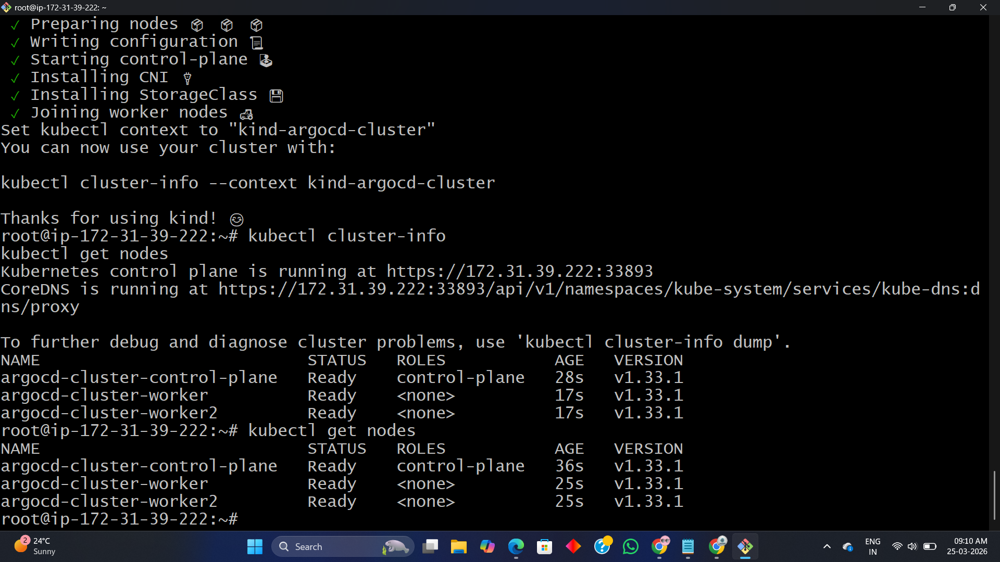
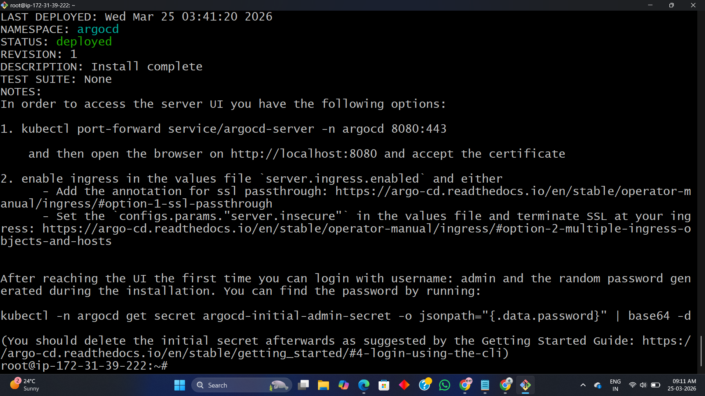
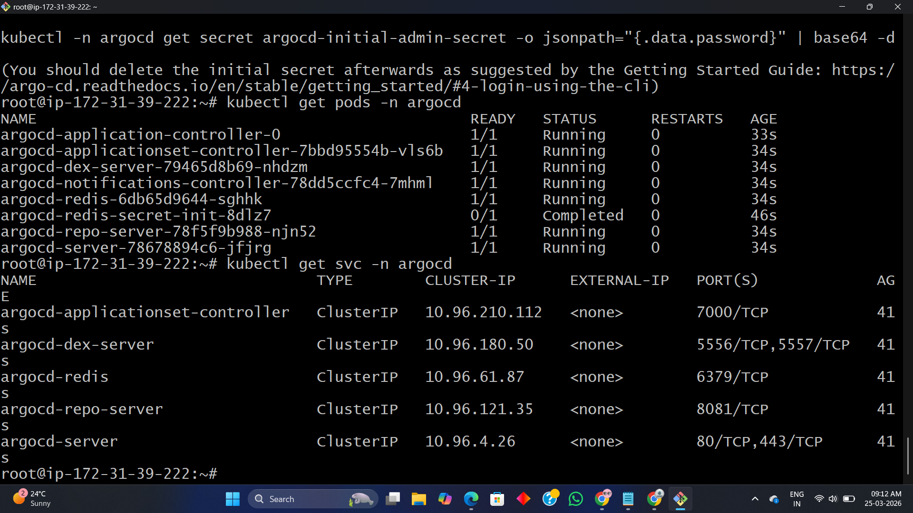
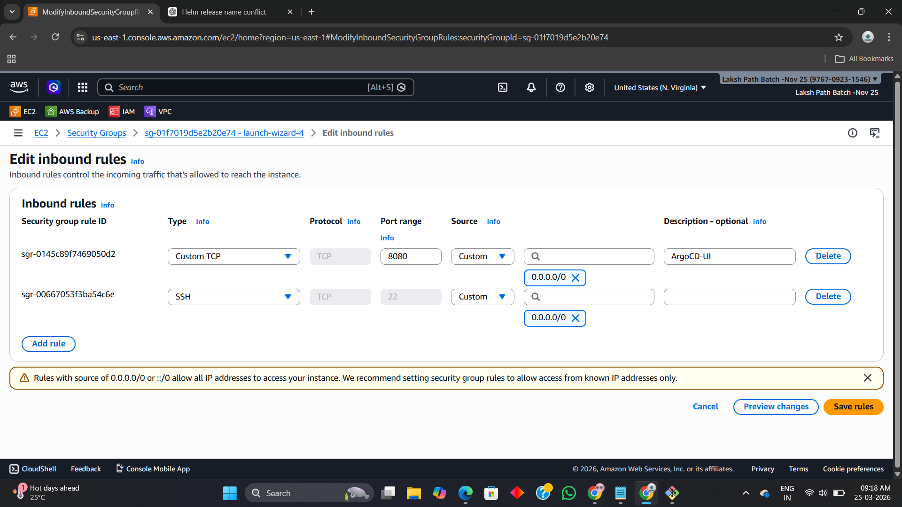
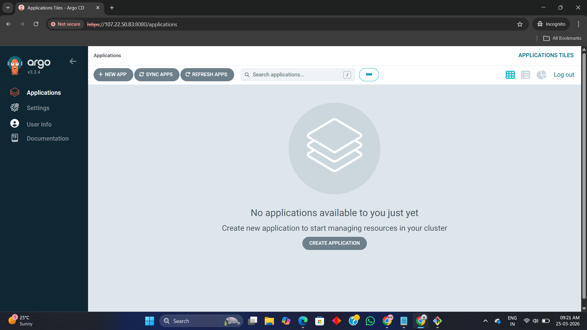

# 🚀 ArgoCD Setup on Kind (Kubernetes)

## 📌 Overview
This project demonstrates how to set up **ArgoCD on a Kubernetes cluster using Kind**.

---

## 🏗️ Architecture
GitHub Repo → ArgoCD → Kubernetes (Kind Cluster)

---

## ⚙️ Prerequisites
- Docker
- Kind
- kubectl
- Helm
- EC2 / Linux machine

---

## 🚀 Setup Steps

### 1. Create Kind Cluster


### 2. Verify Cluster


### 3. Install ArgoCD


### 4. Verify Pods & Services


### 5. Open Security Group Port


### 6. Access ArgoCD UI


---

## 🧪 Testing
```bash
kubectl get pods -n argocd
```

---

## 🧨 Destroy
```bash
kind delete cluster --name argocd-cluster
```

---

## 💡 Key Learnings
- GitOps using ArgoCD
- Kubernetes cluster setup via Kind
- Helm-based installation
